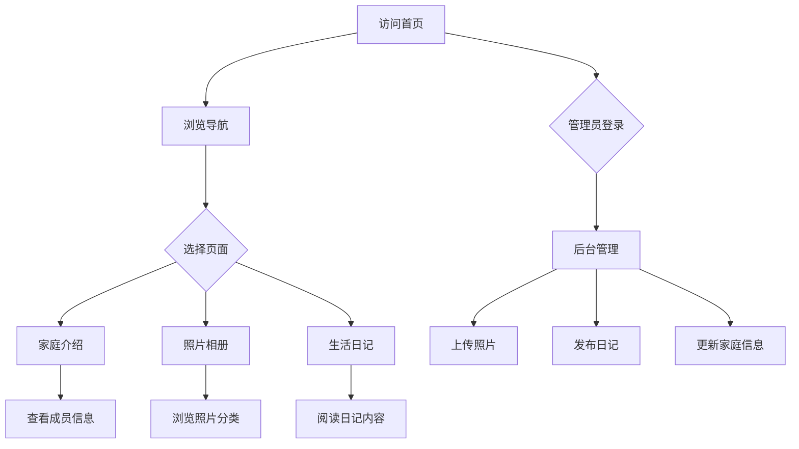

## 1. Product Overview
本项目是一个家庭综合展示网站，面向公开访问的用户，旨在展示家庭生活、分享照片和记录生活点滴，营造温馨和谐的家庭氛围。

## 2. Core Features

### 2.1 User Roles
| Role | Registration Method | Core Permissions |
|------|---------------------|------------------|
| Visitor | No registration | Browse all public content |
| Admin | Password login | Manage all content (photos, diary, family info) |

### 2.2 Feature Module
1. **首页**: Hero区域、导航栏、快速导航、最新内容预览
2. **家庭介绍页**: 家庭成员信息、家庭故事、家庭理念
3. **照片相册页**: 按时间/事件分类的照片展示、照片查看器
4. **生活日记页**: 日记列表、日记详情、日期归档
5. **后台管理**: 登录、内容管理（照片/日记/家庭信息）

### 2.3 Page Details
| Page Name | Module Name | Feature description |
|-----------|-------------|---------------------|
| 首页 | Hero区域 | 家庭主题大图展示，简洁温馨的标语 |
| 首页 | 导航栏 | 固定顶部导航，包含首页、家庭介绍、相册、日记链接 |
| 首页 | 最新内容预览 | 展示最新上传的照片和日记摘要 |
| 家庭介绍页 | 家庭概览 | 家庭名称、标语、家庭照片 |
| 家庭介绍页 | 成员列表 | 展示每位家庭成员的照片、姓名和简介 |
| 家庭介绍页 | 家庭故事 | 家庭的组建历程、重要事件 |
| 照片相册页 | 相册分类 | 按年份或事件分类的相册列表 |
| 照片相册页 | 照片网格 | 瀑布流或网格展示照片缩略图 |
| 照片相册页 | 照片查看器 | 点击照片弹出大图查看，支持切换浏览 |
| 生活日记页 | 日记列表 | 按时间倒序排列的日记卡片列表 |
| 生活日记页 | 日记详情 | 日记完整内容展示，包含发布日期和分类 |
| 生活日记页 | 日期归档 | 按年月归档，方便查找历史日记 |
| 后台管理 | 登录页面 | 管理员用户名密码登录 |
| 后台管理 | 内容管理 | 照片上传与管理、日记发布与编辑、家庭信息更新 |
| 后台管理 | 社交分享 | 支持分享到微信、微博等平台 |

## 3. Core Process
用户访问网站首页，可通过导航栏浏览家庭介绍、照片相册或生活日记。管理员登录后台后可发布新内容或编辑已有内容。

## 4. User Interface Design

### 4.1 Design Style
- **主色调**: 暖色系（米黄色 #FDF6E3、浅橙色 #F5A623、暖灰色 #8B7355）
- **辅助色**: 深棕色 #5D4E37 用于文字，浅米色 #FAF8F5 用于背景
- **按钮样式**: 圆角矩形，悬停时有轻微缩放效果
- **字体**: 标题使用优雅衬线字体，正文使用清晰无衬线字体
- **布局**: 卡片式布局，充足留白，层次分明
- **图标**: 使用简洁线条图标，温暖风格

### 4.2 Page Design Overview
| Page Name | Module Name | UI Elements |
|-----------|-------------|-------------|
| 首页 | Hero区域 | 全屏背景图片，半透明遮罩，居中标题和副标题，适度动效 |
| 首页 | 导航栏 | 固定顶部，白色背景，文字链接，滚动时有阴影效果 |
| 首页 | 最新内容预览 | 横向滚动卡片，悬停放大效果 |
| 家庭介绍页 | 成员卡片 | 圆形头像，姓名标签，简短介绍，悬停显示更多 |
| 照片相册页 | 照片网格 | 响应式网格布局，图片hover时有放大和阴影效果 |
| 照片相册页 | 照片查看器 | 全屏模态框，左右切换按钮，背景模糊效果 |
| 生活日记页 | 日记卡片 | 圆角卡片，日期标签，摘要预览，阅读全文按钮 |
| 后台管理 | 登录页 | 居中登录表单，简洁验证提示 |
| 后台管理 | 内容管理 | 侧边栏导航，表单输入区域，预览区域 |

### 4.3 Responsiveness
- **Desktop-first**: 优先优化电脑端显示
- **浏览器兼容**: Chrome、Firefox、Safari、Edge最新版

### 4.4 Interactions
- 页面平滑滚动
- 图片懒加载
- 悬停微动画效果
- 页面过渡动画
- 照片查看器平滑切换