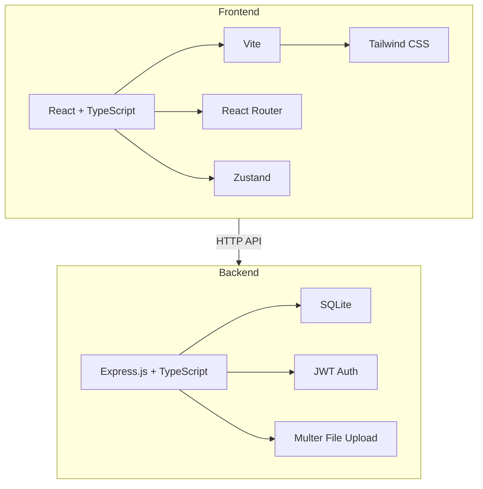
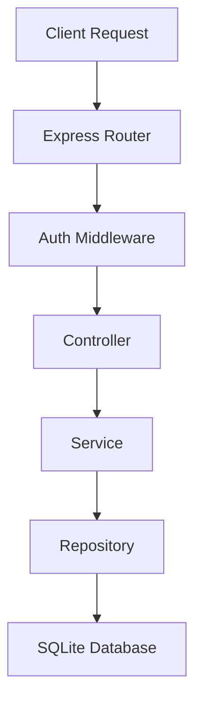
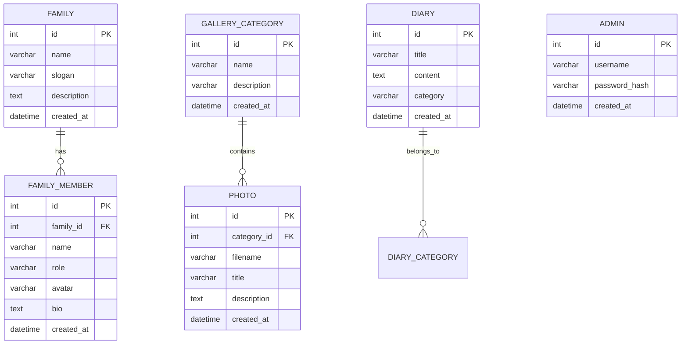

## 1. Architecture Design


## 2. Technology Description
- **Frontend**: React@18 + TypeScript + Vite
- **CSS Framework**: Tailwind CSS@3
- **Routing**: React Router DOM@6
- **State Management**: Zustand
- **Icons**: Lucide React
- **Backend**: Express.js@4 + TypeScript
- **Database**: SQLite (file-based, lightweight)
- **Authentication**: JWT tokens
- **File Upload**: Multer
- **Build Tool**: Vite

## 3. Route Definitions

### Frontend Routes
| Route | Purpose |
|-------|---------|
| / | 首页，展示家庭概览和最新内容 |
| /family | 家庭介绍页，展示家庭成员和故事 |
| /gallery | 照片相册页，展示照片分类和照片网格 |
| /diary | 生活日记页，展示日记列表和详情 |
| /admin/login | 管理员登录页 |
| /admin | 后台管理首页 |
| /admin/gallery | 照片管理 |
| /admin/diary | 日记管理 |
| /admin/family | 家庭信息管理 |

### Backend API Routes
| Route | Method | Purpose |
|-------|--------|---------|
| /api/auth/login | POST | 管理员登录 |
| /api/family | GET | 获取家庭信息 |
| /api/family | PUT | 更新家庭信息 |
| /api/family/members | GET | 获取家庭成员列表 |
| /api/family/members | POST | 添加家庭成员 |
| /api/family/members/:id | PUT | 更新家庭成员 |
| /api/family/members/:id | DELETE | 删除家庭成员 |
| /api/gallery/categories | GET | 获取相册分类 |
| /api/gallery/categories | POST | 创建相册分类 |
| /api/gallery/categories/:id | DELETE | 删除相册分类 |
| /api/gallery/photos | GET | 获取照片列表 |
| /api/gallery/photos | POST | 上传照片 |
| /api/gallery/photos/:id | DELETE | 删除照片 |
| /api/diary | GET | 获取日记列表 |
| /api/diary | POST | 创建日记 |
| /api/diary/:id | GET | 获取日记详情 |
| /api/diary/:id | PUT | 更新日记 |
| /api/diary/:id | DELETE | 删除日记 |
| /api/upload | POST | 文件上传 |

## 4. API Definitions

### Auth API
**POST /api/auth/login**
- Request: `{ username: string, password: string }`
- Response: `{ token: string, user: { id: number, username: string } }`

### Family API
**GET /api/family**
- Response: `{ id: number, name: string, slogan: string, description: string, createdAt: string }`

**PUT /api/family**
- Request: `{ name: string, slogan: string, description: string }`
- Response: `{ success: boolean, message: string }`

**GET /api/family/members**
- Response: `[{ id: number, name: string, role: string, avatar: string, bio: string, createdAt: string }]`

**POST /api/family/members**
- Request: `{ name: string, role: string, avatar: string, bio: string }`
- Response: `{ success: boolean, member: Member }`

### Gallery API
**GET /api/gallery/categories**
- Response: `[{ id: number, name: string, description: string, createdAt: string }]`

**POST /api/gallery/categories**
- Request: `{ name: string, description: string }`
- Response: `{ success: boolean, category: Category }`

**GET /api/gallery/photos**
- Query: `categoryId?: number, page?: number, limit?: number`
- Response: `{ photos: [{ id: number, categoryId: number, filename: string, title: string, description: string, createdAt: string }], total: number }`

**POST /api/gallery/photos**
- FormData: `{ categoryId: number, title: string, description: string, file: File }`
- Response: `{ success: boolean, photo: Photo }`

### Diary API
**GET /api/diary**
- Query: `page?: number, limit?: number, category?: string`
- Response: `{ diaries: [{ id: number, title: string, content: string, category: string, createdAt: string }], total: number }`

**POST /api/diary**
- Request: `{ title: string, content: string, category: string }`
- Response: `{ success: boolean, diary: Diary }`

**GET /api/diary/:id**
- Response: `{ id: number, title: string, content: string, category: string, createdAt: string }`

## 5. Server Architecture Diagram


## 6. Data Model

### 6.1 Data Model Definition


### 6.2 Data Definition Language

```sql
CREATE TABLE IF NOT EXISTS family (
    id INTEGER PRIMARY KEY AUTOINCREMENT,
    name VARCHAR(100) NOT NULL,
    slogan VARCHAR(200),
    description TEXT,
    created_at DATETIME DEFAULT CURRENT_TIMESTAMP
);

CREATE TABLE IF NOT EXISTS family_member (
    id INTEGER PRIMARY KEY AUTOINCREMENT,
    family_id INTEGER NOT NULL,
    name VARCHAR(50) NOT NULL,
    role VARCHAR(30) NOT NULL,
    avatar VARCHAR(255),
    bio TEXT,
    created_at DATETIME DEFAULT CURRENT_TIMESTAMP,
    FOREIGN KEY (family_id) REFERENCES family(id)
);

CREATE TABLE IF NOT EXISTS gallery_category (
    id INTEGER PRIMARY KEY AUTOINCREMENT,
    name VARCHAR(100) NOT NULL,
    description VARCHAR(500),
    created_at DATETIME DEFAULT CURRENT_TIMESTAMP
);

CREATE TABLE IF NOT EXISTS photo (
    id INTEGER PRIMARY KEY AUTOINCREMENT,
    category_id INTEGER NOT NULL,
    filename VARCHAR(255) NOT NULL,
    title VARCHAR(200),
    description TEXT,
    created_at DATETIME DEFAULT CURRENT_TIMESTAMP,
    FOREIGN KEY (category_id) REFERENCES gallery_category(id)
);

CREATE TABLE IF NOT EXISTS diary (
    id INTEGER PRIMARY KEY AUTOINCREMENT,
    title VARCHAR(200) NOT NULL,
    content TEXT NOT NULL,
    category VARCHAR(50),
    created_at DATETIME DEFAULT CURRENT_TIMESTAMP
);

CREATE TABLE IF NOT EXISTS admin (
    id INTEGER PRIMARY KEY AUTOINCREMENT,
    username VARCHAR(50) NOT NULL UNIQUE,
    password_hash VARCHAR(255) NOT NULL,
    created_at DATETIME DEFAULT CURRENT_TIMESTAMP
);
```

### 6.3 Initial Data
```sql
INSERT INTO family (name, slogan, description) VALUES (
    '幸福之家',
    '温馨和谐，幸福美满',
    '我们是一个充满爱与欢笑的家庭，感谢您的访问！'
);

INSERT INTO family_member (family_id, name, role, avatar, bio) VALUES
(1, '爸爸', '父亲', 'father.png', '家里的顶梁柱，热爱工作和家庭'),
(1, '妈妈', '母亲', 'mother.png', '温柔贤惠，照顾全家的生活'),
(1, '哥哥', '儿子', 'me.png', '阳光开朗，热爱运动'),
(1, '妹妹', '女儿', 'sister.png', '聪明可爱，活泼好动');

INSERT INTO gallery_category (name, description) VALUES
('家庭聚会', '记录家庭团聚的美好时刻'),
('旅行时光', '一起走过的风景'),
('日常生活', '平凡中的幸福');

INSERT INTO admin (username, password_hash) VALUES (
    'admin',
    '$2b$10$EixZaYbB.rK4fl8x2q7Meu6Q6D5U.5fF5Q5Q5Q5Q5Q5Q5Q5Q5Q5'
);
```